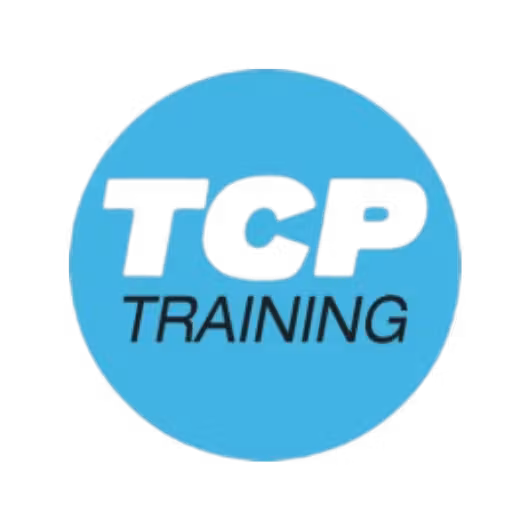
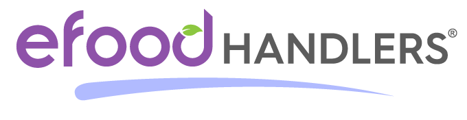

<h2 align="center"> Certificates </h2>

<table>
  <tbody>
        <!-- WHMIS -->
    <tr>
      <td></td>
      <td><strong><a href="https://www.canadasafetytraining.com/products/whmis-online-certification.aspx" target="_blank" rel="noopener noreferrer">WHMIS</a></strong></td>
      <td><em><a href="https://whmis.org/" target="_blank" rel="noopener noreferrer">WHMIS</a></em></td>
      <td>--</td>
      <td></td>
      <td><a href="https://swiftlearning.com/" target="_blank" rel="noopener noreferrer">Swift Learning</a></td>
      <td><em><a href="https://github.com/1247350913/content/blob/main/qualifications/pdfs/WHMIS.pdf">2026</a></em></td>
      <td><a>link</a></td>
    </tr>
        <!-- ML -->
    <tr>
      <td></td>
      <td><strong><a href="https://www.coursera.org/learn/machine-learning" target="_blank" rel="noopener noreferrer">Machine Learning</a></strong></td>
      <td><em><a href="https://www.coursera.org/" target="_blank" rel="noopener noreferrer">Coursera</a></em></td>
      <td><a href="https://www.google.com/search?q=Andrew+Ng" target="_blank" rel="noopener noreferrer">Andrew Ng</a></td>
      <td></td>
      <td><em><a href="https://online.stanford.edu/" target="_blank" rel="noopener noreferrer">Stanford Online</a></em></td>
      <td><em>2026</a></em></td>
      <td><a>link</a></td>
    </tr>
        <!-- AV Associate -->
    <tr>
      <td></td>
      <td><strong><a href="https://www.extron.com/article/avassociate">AV Associate</a></strong></td>
      <td><em><a href="https://www.extron.com/">Extron</a></em></td>
      <td>--</td>
      <td>--</td>
      <td>--</td>
      <td><em><a href="https://github.com/1247350913/content/blob/main/qualifications/pdfs/AV Associate.pdf">2026</a></em></td>
      <td><a>link</a></td>
    </tr>
        <!-- HR -->
    <tr>
      <td></td>
      <td><strong><a href="https://www.hackreactor.com/online-coding-bootcamp/part-time-coding-bootcamp/">Full-Stack Engineering</a></strong></td>
      <td><em><a href="https://www.galvanize.com/">Galvanize Inc.</a></em></td>
      <td>--</td>
      <td></td>
      <td><em><a href="https://www.hackreactor.com/">Hack Reactor</a></em></td>
      <td><em><a href="https://github.com/1247350913/content/blob/main/qualifications/pdfs/Full-Stack Engineering.pdf">2023</a></em></td>
      <td><a>link</a></td>
    </tr>
        <!-- PBI -->
    <tr>
      <td></td>
      <td><strong><a href="https://www.edx.org/learn/power-bi/davidson-college-analyzing-and-visualizing-data-with-power-bi">Analyzing and Visualizing Data with Power BI</a></strong></td>
      <td><em><a href="https://www.edx.org/">edX</a></em></td>
      <td><a href="https://www.google.com/search?q=Pete+Benbow">Pete Benbow</a></td>
      <td></td>
      <td><em><a href="https://www.edx.org/school/davidsonx">Davidson College</a></em></td>
      <td><em><a href="https://github.com/1247350913/content/blob/main/qualifications/pdfs/Analyzing and Visualizing Data with Power BI.pdf">2022</a></em></td>
      <td><a>link</a></td>
    </tr>
         <!-- Food Handler -->
    <tr>
      <td></td>
      <td><strong><a href="https://www.efoodhandlers.com/Food-Handlers/">eFoodHandler Basic Safety Course</strong></td>
      <td><em><a href="https://www.tpctraining.com">TCP</a></em></td>
      <td>----</td>
      <td></td>
      <td><em><a href="https://www.efoodhandlers.com">efood Handlers</a></em></td>
      <td><em><a href="https://github.com/1247350913/content/blob/main/qualifications/pdfs/efoodHandler1.pdf">2021</a></em></td>
      <td><a>link</a></td>
    </tr>
  </tbody>
</table>
